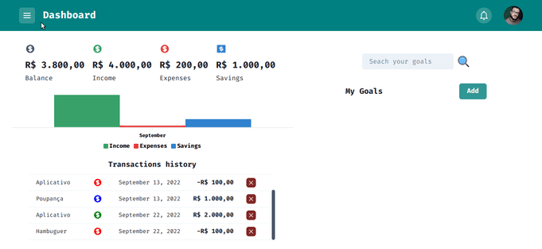
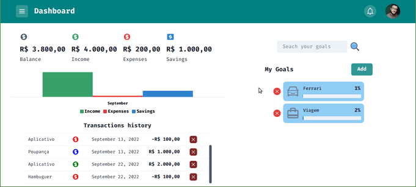

<h1 align="center">Easy Bank :chart:</h1>

<p align="left">Aplicação consiste em um panel financeiro completo e com um design moderno, a ideia é ser intuivo, simples, funcional e morderno.  A aplicação foi criada usando tecnologias bem atuais como Next JS, Chakra UI e React Query</p>

##

<br>


<h1 align="left">
  
  
  
  
  
  
  

</h1>

## Tecnologias :hammer_and_pick:

As seguintes ferramentas foram usadas na construção do projeto:

- [x] [Next JS](https://nextjs.org/)
- [x] [TypeScript](https://www.typescriptlang.org/)
- [x] [Chakra-UI](https://chakra-ui.com/)
- [x] [FaunaBD](https://fauna.com/)
- [x] [yup](https://www.npmjs.com/package/yup)
- [x] [ApexCharts](https://apexcharts.com/)
- [x] [React-Query](https://tanstack.com/query/v4/docs/overview)
- [x] [axios](https://axios-http.com/ptbr/docs/intro)
- [x] [React JS](https://pt-br.reactjs.org/)
- [x] [Context API](https://pt-br.reactjs.org/docs/context.html)
- [x] [UUID](https://www.npmjs.com/package/uuid) 
- [x] [REACT-HOOK-FORM](https://react-hook-form.com/)
- [x] [NEXT-AUTH](https://next-auth.js.org/)


## Pré-requisitos

Antes de começar, você vai precisar ter instalado em sua máquina as seguintes ferramentas:
[GIT](https://git-scm.com/), [Node.js](https://nodejs.org/en/).

Além disto é bom ter um editor para trabalhar com o código como [VSCode](https://code.visualstudio.com/)


## Rodando o App

```bash
# Clone este repositório
$ git clone https://github.com/CleberWacheski/Easy-Bank
# Acesse a pasta do projeto no terminal/cmd
$ cd Easy-Bank
# Instale as dependências
$ npm install 
# Inicie o expo
$ npm run dev
```


